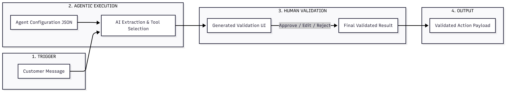
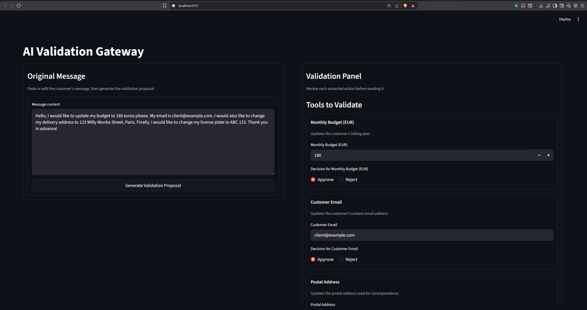
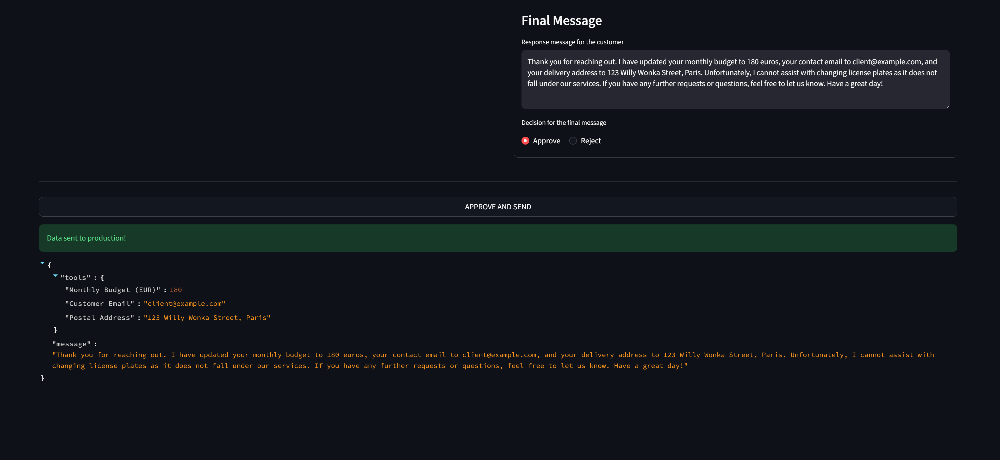

# Human-Validation-Interface-Generation-and-Implementation

This project is a small Streamlit application that turns a customer message into structured update actions with GPT-4o, then asks a human to review everything before validation.

## Architecture diagram


## Data Flow

In practice, the flow is simple: configuration data is loaded first, then used to guide AI extraction, and finally transformed into a review interface.

1. The app loads `agent_config.json` and creates a metadata map for tools.
2. Tool definitions are injected into `prompt_instructions` so the model only proposes known actions.
3. The user writes or pastes a customer message in the left panel.
4. The app calls GPT-4o with the prompt and asks for a JSON response.
5. If part of the request does not clearly match one of the available agent functions, it is ignored instead of being forced into an incorrect action.
6. The returned `ui_schema["tools"]` is parsed and used to build the interface dynamically.
7. The response message can also mention that some requests could not be fulfilled because no matching function exists.
8. Input widgets are selected from the extracted type (`number_input` for numbers, `text_input` for text).
9. Readable labels and descriptions are taken from `agent_config.json`.
10. The reviewer can edit values and mark each item as `Approve` or `Reject`.
11. The final payload includes only approved tools, plus the final response message if it is approved.
12. The payload is shown in Streamlit as JSON.

### Project Files

- `app.py`: End-to-end prototype implementation.
- `agent_config.json`: Agent tool catalog and UI metadata.
- `requirements.txt`: Runtime dependencies.

### Run Locally

Install dependencies:

```bash
pip install -r requirements.txt
```

Create secret file:

```toml
OPENAI_API_KEY = "your_openai_api_key_here"
```

Run the app:

```bash
streamlit run app.py
```

The app opens in Streamlit. You can paste a customer message, generate a proposal, review each extracted action, and approve or reject what should be kept.

## Technical Considerations

The goal of this prototype is to quickly provide a practical human-validation layer on top of AI extraction. Streamlit was chosen because it is easy to use, fast to develop, and flexible enough to generate dynamic forms with very few lines of code.

The project is driven by `agent_config.json`. In practice, adding a new operation usually means adding a new tool entry in the config, not rewriting the full application. This keeps the core logic stable while letting the interface adapt to new fields.

Another key choice is to keep a human in the loop. The model can make mistakes, so every extracted value can be reviewed, edited, approved, or rejected before creating the final payload. The model is also asked to return structured JSON to reduce ambiguity.

The model is not supposed to invent actions that are not defined in the agent configuration. If a customer asks for something that is not clearly covered by one of the available functions, that part is ignored, and the reply message can explain that this request cannot be handled by the system.

The API key is stored in `.streamlit/secrets.toml` instead of being hard-coded in the source code. This is safer for local development and easier to manage across environments.

This version keeps monitoring simple: the app shows the final payload directly in the interface so it is easy to inspect what will be sent downstream.

The app is lightweight, and `@st.cache_data` helps avoid unnecessary recomputation for repeated inputs. The main delay still comes from the external model call.

Finally, the validated payload can be used in two ways: it can directly trigger backend functions that execute the approved updates, or it can be passed to an orchestration agent that knows how to route and process these instructions.

## Localhost Screenshots

The two screenshots below were captured from the running Streamlit app on localhost.






